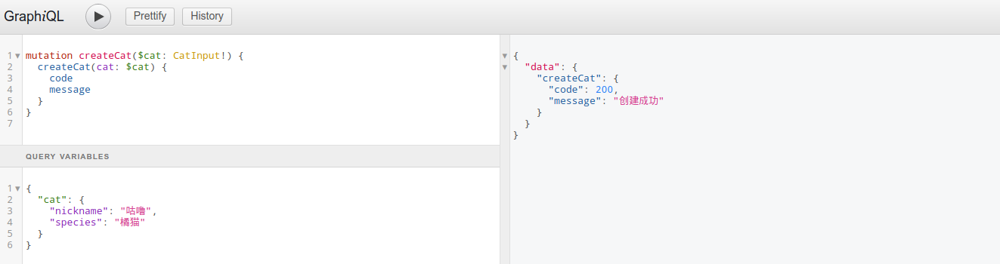
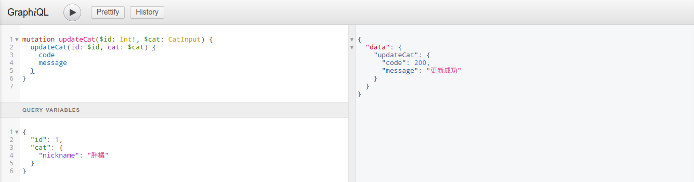
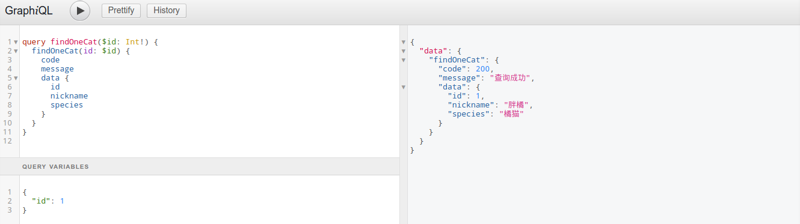

# Nestjs CRUD Demo

## 先决条件

安装nodejs、typescript、PostgreSQL数据库

## Step 1 准备自己喜欢的开发工具

这里我推荐使用 [Visual Studio Code(VS Code)](https://code.visualstudio.com)，插件推荐：

- npm
- TSLint
- Typescript Hero
- Code Runner
- .gitignore Generator
- Settings Sync
- TODO hignlight

备注：这些插件的作用，请大家自行查阅，安装自己喜欢的即可。

## Step 2 创建项目

创建一个名称为 crud-demo 的文件夹，使用 VS Code 打开，并按照例子创建项目骨架和必要的文件

```bash
# 安装依赖
$ npm install
```

其中 `package-lock.json` 文件是安装依赖时自动生成的，不需要手动创建

```no-language
src
 |-- app.controller.ts  // 应用程序控制器
 |-- app.service.ts     // 应用程序业务逻辑
 |-- app.module.ts      // 应用程序根模块
 |-- main.ts                  // 应用程序入口文件
nodemon-debug.json  // nodemon `debug` 模式配置文件
nodemon.json        // nodemon 配置文件
package.json        // 定义了这个项目所需要的各种模块，以及项目的配置信息
package-lock.json   // 各种模块的版本锁文件，用于后续加速安装依赖
tsconfig.json       // 文件中指定了用来编译这个项目的根文件和编译选项
tslint.json         // ts 语法检查配置文件
```

## Step 3 创建 Hello World

`app.controller.ts`

```typescript
import { Controller, Get, Inject } from '@nestjs/common';

import { AppService } from './app.service';

/**
 * 应用程序控制器，@Controller() 可以指定参数，用于定义类的父路由，如 @Controller("cat")，此时这个类的所有父路由就会成为 /cat
 *
 * 被 @Controller() 修饰的类，可以通过其构造函数完成依赖注入，但依赖注入的类必须与当前类属于同一个模块
 */
@Controller()
export class AppController {

    /**
     * 构造函数，用于注入这个类的依赖，注入类时，需要使用 @Inject() 修饰符，其参数是被注入的类的类名
     */
    constructor(
        @Inject(AppService) private readonly appService: AppService,
    ) { }

    /**
     * @Get() 可以指定参数，用于定义方法路由，如 @Get(":id")，此时这个方法路由就会成为 /cat/:id，即查询指定ID的猫猫
     */
    @Get()
    async root() {
        return this.appService.root();
    }
}
```

`app.service.ts`

```typescript
import { Injectable } from '@nestjs/common';

/**
 * 被 @Injectable() 修饰的类，可以通过其构造函数完成依赖注入，但依赖注入的类必须与当前类属于同一个模块
 */
@Injectable()
export class AppService {
    constructor() { } // 构造函数，一般用于处理依赖注入

    async root() {
        return 'Hello World!';
    }
}
```

`app.module.ts`

```typescript
import { Module } from '@nestjs/common';
import { APP_INTERCEPTOR } from '@nestjs/core';
import { TypeOrmModule } from '@nestjs/typeorm';
import { CatModule } from 'cats/cat.module';
import { ErrorsInterceptor } from 'common/errors.interceptor';

import { AppController } from './app.controller';
import { AppService } from './app.service';

/**
 * @Module() 定义一个模块，并管理这个模块的导入集合、控制器集合、提供者集合、导出集合
 */
@Module({
    imports: [TypeOrmModule.forRoot(), CatModule],  // 导入其他模块的集合
    controllers: [AppController],  // 当前模块的控制器集合
    providers: [
        {
            provide: APP_INTERCEPTOR,
            useClass: ErrorsInterceptor
        },
        AppService
    ],  // 当前模块的提供者集合
    exports: [], // 导出当前模块的提供者，用于被其他模块调用
})
export class AppModule { }
```

`main.ts`

```typescript
import { NestFactory } from '@nestjs/core';

import { AppModule } from './app.module';

async function bootstrap() {
    const app = await NestFactory.create(AppModule);  // 创建应用程序实例，此时所有被 AppModule 导入的其他模块的所有实例都会被加载
    await app.listen(3000);  // 使用3000端口监听应用程序
}

bootstrap();  // 启动应用程序 -> localhost:3000
```

启动应用程序 `$ npm run start`，打开浏览器输入 `localhost:3000`！

## Step 4 创建 CRUD Restful Api

`cat.controller.ts`

```typescript
import { Body, Controller, Delete, Get, Inject, Param, Post, Put } from '@nestjs/common';
import { Result } from 'common/result.interface';

import { Cat } from './cat.entity';
import { CatService } from './cat.service';

@Controller('cat')
export class CatController {
    constructor(
        @Inject(CatService) private readonly CatService: CatService,
    ) { }

    @Post()
    async createCat(@Body() Cat: Cat): Promise<Result> {
        await this.CatService.createCat(Cat);
        return { code: 200, message: '创建成功' };
    }

    @Delete(':id')
    async deleteCat(@Param('id') id: number): Promise<Result> {
        await this.CatService.deleteCat(id);
        return { code: 200, message: '删除成功' };
    }

    @Put(':id')
    async updateCat(@Param('id') id: number, @Body() Cat: Cat): Promise<Result> {
        await this.CatService.updateCat(id, Cat);
        return { code: 200, message: '更新成功' };
    }

    @Get(':id')
    async findOneCat(@Param('id') id: number): Promise<Result> {
        const data = await this.CatService.findOneCat(id);
        return { code: 200, message: '查询成功', data };
    }
}
```

`cat.service.ts`

```typescript
import { HttpException, Injectable } from '@nestjs/common';
import { InjectRepository } from '@nestjs/typeorm';
import { Repository } from 'typeorm';

import { Cat } from './cat.entity';

@Injectable()
export class CatService {
    constructor(
        @InjectRepository(Cat) private readonly catRepo: Repository<Cat>,  // 使用泛型注入对应类型的存储库实例
    ) { }

    /**
     * 创建猫猫
     *
     * @param cat 猫猫实体对象
     */
    async createCat(cat: Cat): Promise<Cat> {
        /**
         * 创建新的实体实例，并将此对象的所有实体属性复制到新实体中。 请注意，它仅复制实体模型中存在的属性。
         */
        // this.catRepo.create(cat);

        // 插入数据时，删除 id，以避免请求体内传入 id
        delete cat.id;
        return this.catRepo.save(cat);

        /**
         * 将给定实体插入数据库。与save方法不同，执行原始操作时不包括级联，关系和其他操作。
         * 执行快速有效的INSERT操作。不检查数据库中是否存在实体，因此如果插入重复实体，本次操作将失败。
         */
        // await this.catRepo.insert(cat);
    }

    /**
     * 删除猫猫
     *
     * @param id 猫猫ID
     */
    async deleteCat(id: number): Promise<void> {
        await this.findOneById(id);
        this.catRepo.delete(id);
    }

    /**
     * 更新猫猫
     *
     * @param cat 猫猫实体对象
     */
    async updateCat(id: number, cat: Cat): Promise<void> {
        await this.findOneById(id);
        // 更新数据时，删除 id，以避免请求体内传入 id
        delete cat.id;
        this.catRepo.update(id, cat);
    }

    /**
     * 根据猫猫ID查询猫猫
     *
     * @param id 猫猫ID
     */
    async findOneCat(id: number): Promise<Cat> {
        return this.findOneById(id);
    }

    /**
     * 根据ID查询单个猫猫信息，如果不存在则抛出404异常
     * @param id 猫猫ID
     */
    private async findOneById(id: number): Promise<Cat> {
        const catInfo = await this.catRepo.findOne(id);
        if (!catInfo) {
            throw new HttpException(`指定 id=${id} 的猫猫不存在`, 404);
        }
        return catInfo;
    }
}
```

`cat.entity.ts`

```typescript
import { Column, Entity, PrimaryGeneratedColumn } from 'typeorm';

@Entity('cat')
export class Cat {
    /**
     * 自增主键
     */
    @PrimaryGeneratedColumn({
        comment: '猫猫的自增ID'
    })
    id: number;

    /**
     * 猫猫昵称
     */
    @Column({
        comment: '猫猫昵称'
    })
    nickname: string;

    /**
     * 猫猫品种
     */
    @Column({
        comment: '猫猫品种'
    })
    species: string;
}
```

`cat.module.ts`

```typescript
import { Module } from '@nestjs/common';
import { TypeOrmModule } from '@nestjs/typeorm';

import { CatController } from './cat.controller';
import { Cat } from './cat.entity';
import { CatService } from './cat.service';

@Module({
    imports: [TypeOrmModule.forFeature([Cat])],
    controllers: [CatController],
    providers: [CatService],
})
export class CatModule { }
```

接下来，就可以使用 Postman 测试接口了

## Step 5 创建 CRUD GraphQL Api

`cat.resolver.ts`

```typescript
import { Inject } from '@nestjs/common';
import { Mutation, Query, Resolver } from '@nestjs/graphql';

import { Result } from '../common/result.interface';
import { Cat } from './cat.entity';
import { CatService } from './cat.service';

@Resolver()
export class CatResolver {
    constructor(
        @Inject(CatService) private readonly catService: CatService,
    ) { }

    /**
     * Query 和 Mutation 的方法签名默认是 (obj, args, context, info)
     *
     * obj：包含解析程序在父字段上返回的结果的对象，或者在顶级查询字段的情况下，包含从服务器配置传递的根值（rootValue）。一般情况下，定义为 req，即请求对象。
     * args：请求方法中的参数，是一个 JSON 对象，如 { nickname: "胖橘", species: "橘猫" }。一般情况下，定义为 body，即请求体
     * context：这是特定查询中所有解析器共享的对象，用于包含每个请求的状态，包括身份验证信息、数据加载器实例以及解析查询时应考虑的任何其他内容。一般情况下，不使用。
     * info：此参数仅应在高级情况下使用，但它包含有关查询执行状态的信息，包括字段名、从根到字段的路径等。一般情况下，不使用。
     *
     */

    @Mutation('createCat')
    async createCat(req, body: { cat: Cat }): Promise<Result> {
        await this.catService.createCat(body.cat);
        return { code: 200, message: '创建成功' };
    }

    @Mutation('deleteCat')
    async deleteCat(req, body: { id: number }): Promise<Result> {
        await this.catService.deleteCat(body.id);
        return { code: 200, message: '删除成功' };
    }

    @Mutation('updateCat')
    async updateCat(req, body: { id: number, cat: Cat }): Promise<Result> {
        const { id, cat } = body;
        await this.catService.updateCat(id, cat);
        return { code: 200, message: '更新成功' };
    }

    @Query('findOneCat')
    async findOneCat(req, body: { id: number }): Promise<Result> {
        const data = await this.catService.findOneCat(body.id);
        return { code: 200, message: '查询成功', data };
    }
}
```

`cat.types.graphql`

```graphql
type Query {
    findOneCat(id: Int!): CatReult
}

type Mutation {
    createCat(cat: CatInput!): CommonResult
    deleteCat(id: Int!): CommonResult
    updateCat(id: Int!, cat: CatInput): CommonResult
}

type CommonResult {
    code: Int
    message: String
}

type CatReult {
    code: Int
    message: String
    data: CatInfo
}

type CatInfo {
    id: Int
    nickname: String
    species: String
}

input CatInput {
    nickname: String
    species: String
}
```

接下来，打开浏览器，访问 localhost:3000/graphiql。

### 测试用例

#### 创建



#### 删除


#### 更新



#### 查询


