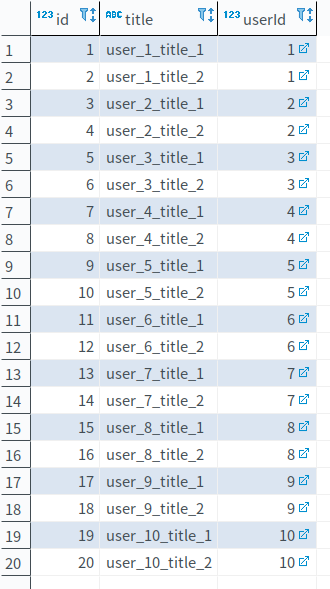

# TypeORM 分页查询问题

## 官方教程

[Using pagination](http://typeorm.io/#/select-query-builder/using-pagination)

开发应用程序时，大部分时间都需要分页功能。如果您的应用程序中有分页、页面滑块或无限滚动组件，则使用此选项。

```typescript
const users = await getRepository(User)
    .createQueryBuilder("user")
    .leftJoinAndSelect("user.photos", "photo")
    .take(10)
    .getManyAndCount();
```

这将会查询前10条用户及其照片的数据。

```typescript
// getManyAndCount 返回一个长度为2的元组，[0] 是分页后的数据数组， [1] 是所有数据总数
const users = await getRepository(User)
    .createQueryBuilder("user")
    .leftJoinAndSelect("user.photos", "photo")
    .skip(10)
    .getManyAndCount();
```

这将会查询除了前10条用户以外的所有人及其照片的数据。

您可以组合使用他们：

```typescript
const users = await getRepository(User)
    .createQueryBuilder("user")
    .leftJoinAndSelect("user.photos", "photo")
    .skip(5)
    .take(10)
    .getManyAndCount();
```

这将会在第6条记录开始查询10条记录，即查询6-16条用户及其照片的数据。

注意：**`take` 和 `skip` 可能看起来像 `limit` 和 `offset`，但它们不是。一旦您有更复杂的连接或子查询查询，`limit` 和 `offset` 可能无法正常工作。使用 `take` 和 `skip` 可以防止出现这些问题。**

## skip + take 与 offset + limit 的区别

当查询中存在连接或子查询时，`skip + take` 的方式总是能正确的返回数据，而 `offset + limit` 返回的数据并不是我们期望的那样。所以查询分页数据时，应该使用 `skip + take`。

### 测试

使用此目录的测试代码既可

```bash
# 在 pagination 目录下，执行

npm install

npm run test
```

#### 例子

```none
// 查询第 4-8 条数据
userRepo.createQueryBuilder('user').leftJoinAndSelect('user.posts', 'post').offset(3).limit(5).getMany();

// 生成的 SQL
query: SELECT "user"."id" AS "user_id", "user"."name" AS "user_name", "post"."id" AS "post_id", "post"."title" AS "post_title", "post"."userId" AS "post_userId" FROM "user" "user" LEFT JOIN "post" "post" ON "post"."userId"="user"."id" LIMIT 5 OFFSET 3

// 结果集
┌─────────┬────┬──────────┬─────────────────────────────────────────────────────────────────────────┐
│ (index) │ id │   name   │                                  posts                                  │
├─────────┼────┼──────────┼─────────────────────────────────────────────────────────────────────────┤
│    0    │ 2  │ 'user_2' │                  '[{"id":3,"title":"user_2_title_1"}]'                  │
│    1    │ 3  │ 'user_3' │ '[{"id":5,"title":"user_3_title_1"},{"id":6,"title":"user_3_title_2"}]' │
│    2    │ 4  │ 'user_4' │ '[{"id":7,"title":"user_4_title_1"},{"id":8,"title":"user_4_title_2"}]' │
└─────────┴────┴──────────┴─────────────────────────────────────────────────────────────────────────┘
```

```none
// 查询第 4-8 条数据
userRepo.createQueryBuilder('user').leftJoinAndSelect('user.posts', 'post').skip(3).take(5).getMany();

// 生成的 SQL
query: SELECT DISTINCT "distinctAlias"."user_id" as "ids_user_id" FROM (SELECT "user"."id" AS "user_id", "user"."name" AS "user_name", "post"."id" AS "post_id", "post"."title" AS "post_title", "post"."userId" AS "post_userId" FROM "user" "user" LEFT JOIN "post" "post" ON "post"."userId"="user"."id") "distinctAlias" ORDER BY "user_id" ASC LIMIT 5 OFFSET 3
query: SELECT "user"."id" AS "user_id", "user"."name" AS "user_name", "post"."id" AS "post_id", "post"."title" AS "post_title", "post"."userId" AS "post_userId" FROM "user" "user" LEFT JOIN "post" "post" ON "post"."userId"="user"."id" WHERE "user"."id" IN (4, 5, 6, 7, 8)

// 结果集
┌─────────┬────┬──────────┬───────────────────────────────────────────────────────────────────────────┐
│ (index) │ id │   name   │                                   posts                                   │
├─────────┼────┼──────────┼───────────────────────────────────────────────────────────────────────────┤
│    0    │ 4  │ 'user_4' │  '[{"id":7,"title":"user_4_title_1"},{"id":8,"title":"user_4_title_2"}]'  │
│    1    │ 5  │ 'user_5' │ '[{"id":9,"title":"user_5_title_1"},{"id":10,"title":"user_5_title_2"}]'  │
│    2    │ 6  │ 'user_6' │ '[{"id":11,"title":"user_6_title_1"},{"id":12,"title":"user_6_title_2"}]' │
│    3    │ 7  │ 'user_7' │ '[{"id":13,"title":"user_7_title_1"},{"id":14,"title":"user_7_title_2"}]' │
│    4    │ 8  │ 'user_8' │ '[{"id":15,"title":"user_8_title_1"},{"id":16,"title":"user_8_title_2"}]' │
└─────────┴────┴──────────┴───────────────────────────────────────────────────────────────────────────┘
```

#### 测试数据

用户表


用户帖子表

